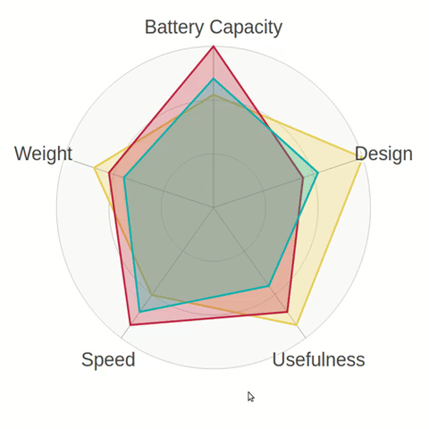

# react-svg-radar-chart


Generate SVG radar charts with React.

[](https://travis-ci.org/Spyna/react-svg-radar-chart)
[](https://coveralls.io/github/Spyna/react-svg-radar-chart?branch=master)



Based on <a href="https://github.com/derhuerst/svg-radar-chart" target="_blank">svg-radar-chart</a>.

## Installing

```shell
npm install react-svg-radar-chart
```

## Demo and Examples

### Running demo

 could be found here: https://spyna.github.io/react-svg-radar-chart/

### Source code

 could be found here: https://github.com/Spyna/react-svg-radar-chart/tree/master/src/demo.

### Run locally


```shell
git clone https://github.com/Spyna/react-svg-radar-chart.git
cd react-svg-radar-chart && npm install;
npm start;

```

## Usage


Import the `RadarChart` component and the default css file.

```js
import RadarChart from 'react-svg-radar-chart';
import 'react-svg-radar-chart/build/css/index.css'
```

Create the dataset you want to draw

```js
const data = [
      {
        data: {
          battery: 0.7,
          design: .8,
          useful: 0.9,
          speed: 0.67,
          weight: 0.8
        },
        meta: { color: 'blue' }
      },
      {
        data: {
          battery: 0.6,
          design: .85,
          useful: 0.5,
          speed: 0.6,
          weight: 0.7
        },
        meta: { color: 'red' }
      }
    ];

const captions = {
      // columns
      battery: 'Battery Capacity',
      design: 'Design',
      useful: 'Usefulness',
      speed: 'Speed',
      weight: 'Weight'
    };

```

Use the component:

```js
<RadarChart
    captions={captions}
    data={data}
    size={450}
  />

```

Where:

 * `captions` are the names that will be drawn on the svg.
 * `data` are the data that will be displayed.
 * `size` is the size of the svg in *pixels*

Putting all togheter

```js
import React from 'react';

import RadarChart from 'react-svg-radar-chart';
import 'react-svg-radar-chart/build/css/index.css'

class App extends React.Component {
  render() {
 	 const data = [
      {
        data: {
          battery: 0.7,
          design: .8,
          useful: 0.9,
          speed: 0.67,
          weight: 0.8
        },
        meta: { color: 'blue' }
      },
      {
        data: {
          battery: 0.6,
          design: .85,
          useful: 0.5,
          speed: 0.6,
          weight: 0.7
        },
        meta: { color: 'red' }
      }
    ];

	const captions = {
      // columns
      battery: 'Battery Capacity',
      design: 'Design',
      useful: 'Usefulness',
      speed: 'Speed',
      weight: 'Weight'
    };

    return (
      <div>
        <RadarChart
            captions={{
              // columns
              battery: 'Battery Capacity',
              design: 'Design',
              useful: 'Usefulness',
              speed: 'Speed',
              weight: 'Weight'
            }}
            data={[
              // data
              {
                data: {
                  battery: 0.7,
                  design: .8,
                  useful: 0.9,
                  speed: 0.67,
                  weight: 0.8
                },
                meta: { color: '#58FCEC' }
              },
            ]}
            size={400}
          />
        </div>
    );
  }
}

export default App;

```

## Props


| Property | meaning | mandatory |
| --- | --- | --- |
| captions | *object* the label on the chart | **yes** |
| data | *array* the data to display | **yes** |
| options | *object* custom options for the chart, see below | no |
| size | *number* custom size, the default is 300 | no |


## Data format

the `data` property must be an array of object composed as following:

```js
const dataset1 = {
 data : {property1 : value1 , property2: value2, ..., propertyN: valueN},
 meta : { color: 'green'}
}
const data = [dataset1, dataset2, ..., datasetN]

```
The `dataset` object must have:
 * a property named `data`: an object with the data to display: `battery: 0.7`. The name of each property must be found in the `captions` object.
 * a property named `meta`: an object with a `color` or `class` property to set the color or the class in the chart.


## Options, styles and defaults.

You can:

* Customize the color of the chart.
* Use your own *stylesheet* to customize the style of the radar chart.
* Pass some *options* to the `RadarChart` component.


 ### Customize the color of the chart

 When generating the `data` object you can use a `meta` property to set the *color* and the *class* of the shape.

 ```js
const dataset1 = {
 data : {...},
 meta : { color: 'green'}
};
const dataset2 = {
 data : {...},
 meta : { class: 'my-custom-class'}
};
```
### Use your own *stylesheet* to customize the style of the radar chart.

In the demo the `'react-svg-radar-chart/build/css/index.css'` is imported, but you can define you own if needed.

If you want to use a custom stylesheet you have to implement these classes:

 * `.shape`: the shape on the radar chart. The deafult is: `fill-opacity: .3;`.

* `.shape:hover` : if you want some *hover* effects. The default is:  `fill-opacity: .65;z-index: 100;`.

* `.scale`: the *circles* in the radar chart. The default is: `fill: #FAFAFA; stroke: #999;stroke-width: .2`.

* `.axis`: the axis of the chart. The default is: `stroke: #555;	stroke-width: .2`.

* `.caption`: the text on the chart. The default is: `fill: #444;	font-weight: 400;	text-shadow: 1px 1px 0 #fff`.

### Pass some *options* to the `RadarChart` component

The `RadarChart` component accepts a property named **options**. The default options are:

```js
const noSmoothing = points => {
  let d = 'M' + points[0][0].toFixed(4) + ',' + points[0][1].toFixed(4);
  for (let i = 1; i < points.length; i++) {
    d += 'L' + points[i][0].toFixed(4) + ',' + points[i][1].toFixed(4);
  }
  return d + 'z';
};

const defaultOptions = {
  size: 200,
  axes: true, // show axes?
  scales: 3, // show scale circles?
  captions: true, // show captions?
  captionMargin: 10,
  dots: false, // show dots?
  zoomDistance: 1.2, // where on the axes are the captions?
  setViewBox: (options) => `-${options.captionMargin} 0 ${options.size + options.captionMargin * 2} ${options.size}`, // custom viewBox ?
  smoothing: noSmoothing, // shape smoothing function
  axisProps: () => ({ className: 'axis' }),
  scaleProps: () => ({ className: 'scale', fill: 'none' }),
  shapeProps: () => ({ className: 'shape' }),
  captionProps: () => ({
    className: 'caption',
    textAnchor: 'middle',
    fontSize: 10,
    fontFamily: 'sans-serif'
  }),
  dotProps: () => ({
    className: 'dot',
    mouseEnter: (dot) => { console.log(dot) },
    mouseLeave: (dot) => { console.log(dot) }
  }),
  rotation: 0
};
```

| Property | meaning |
| --- | --- |
| size | the size in pixels of the svg chart, default is 300, can use only if `size` props is not used |
| axes | *true*/*false* show axes |
| scales | *number* how many scale circles |
| captions | *true*/*false* show captions |
| captionMargin | *number* The margin of the svg, to fit captions |
| dots | *true*/*false* show dots |
| zoomDistance | the distance of the zoom: 0.2 = closest |
| smoothing | the smoothing function |
| setViewBox | a function that take *options*' object as argument and returns viewBox as a string. ViewBox will be added to the *svg*|
| axisProps | a function that take the *current caption name* as arguments and returns an object. All the property will be added to the *axis svg component*|
| scaleProps | a function that take the *value of the scales* as arguments and returns an object. All the property will be added to the *scale svg component*|
| shapeProps | a function that take the *meta of the data* as arguments and returns an object. All the property will be added to the *shape svg component*|
| captionProps |  a function that take the *current caption name* as arguments and returns an object. All the property will be added to the *text svg component*|
| dotProps |  a function that takes the *dot svg component* as arguments and returns an object. All properties will be added to the *dot svg component*. The `mouseEnter` function returns useful information like `key`, `value` and the index of the shape the dot is associated with. See the demo as example for using the information as a tooltip|
| rotation | default `0`: The rotation (clockwise) in degrees. A number that indicates the rotation of the shape and captions. It must be beetween 0 and 360. Eg: `180` makes the chart upside down. `90` rotates the chart of 90 degrees. |
| wrapCaptionAt | default `15`: The max length of the caption before it is wrapped in a new line |
| captionLineHeight | default `20`: The height of the line of a caption when it is wrapped in a new line |